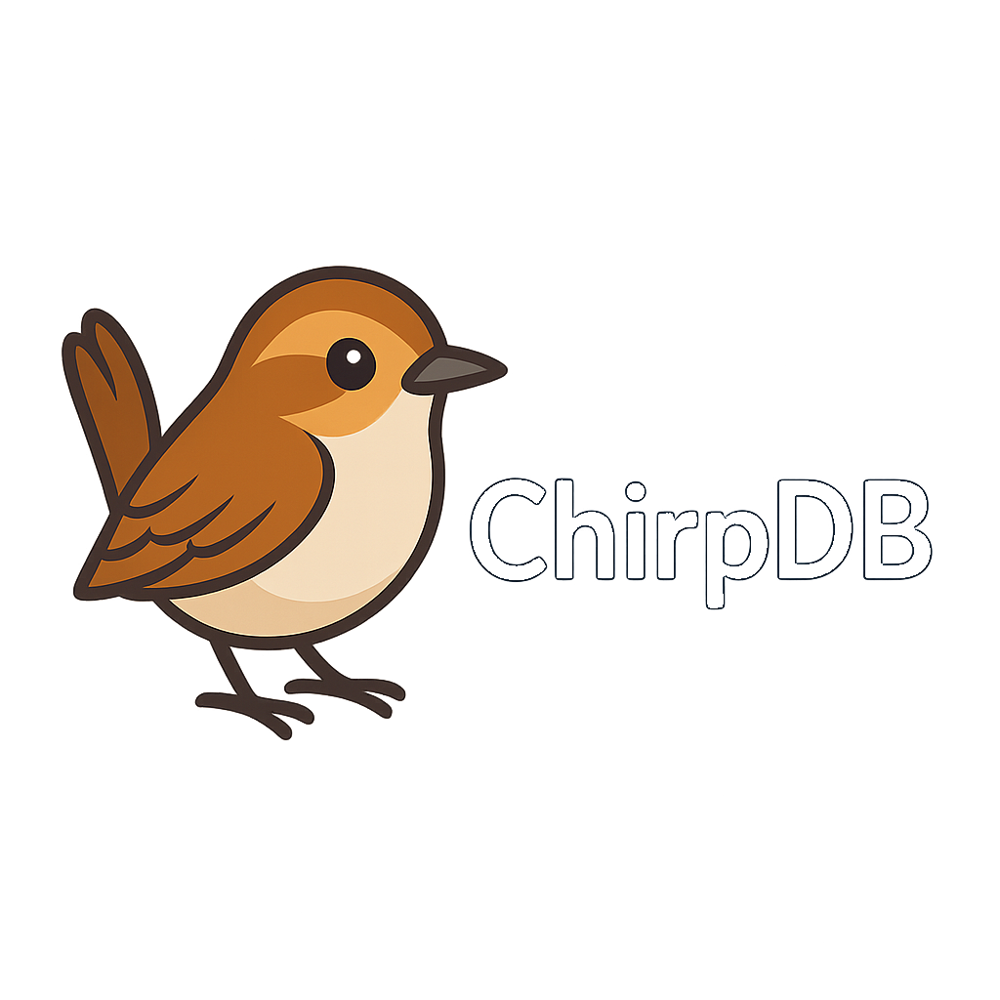

<div align="center">
  
</div>

# ChirpDB

A lightweight, embeddable key-value database with SQL-like querying for JSON documents. ChirpDB is inspired by Bitcask and provides a simple, fast, and durable storage solution with an HTTP API.

## Features

- **Simple Key-Value Storage**: Store arbitrary byte values or JSON documents
- **SQL-like Querying**: Query JSON documents using familiar SQL syntax
- **Append-Only Log**: Durable, crash-resistant storage with CRC32 checksums
- **In-Memory Index**: Fast lookups with O(1) key access
- **Background Compaction**: Automatic or manual compaction to reclaim disk space
- **Batched Writes**: Configurable write batching for improved performance
- **HTTP REST API**: Simple HTTP interface for all operations
- **Concurrent Safe**: Thread-safe operations with read-write locks
- **Zero Dependencies**: Pure Go implementation with no external dependencies

## Architecture

ChirpDB uses a Bitcask-like architecture:

- **Storage**: Single append-only log file (`data.log`) containing all key-value pairs
- **Index**: In-memory hash map mapping keys to file offsets
- **Durability**: Each record includes CRC32 checksum and timestamp
- **Compaction**: Background merge process rewrites live keys to a new file

### Record Format

Each record consists of:
- **Header** (21 bytes): CRC32 (4) | Timestamp (8) | Key Length (4) | Value Length (4) | Flags (1)
- **Key**: Variable length byte array
- **Value**: Variable length byte array

## Installation

### Prerequisites

- Go 1.25.4 or later

### Build from Source

```bash
git clone https://github.com/sklarsen84/chirpdb.git
cd chirpdb
go build -o bin/chirpd ./cmd/chirpd
```

Or use the Makefile:

```bash
make build
```

## Usage

### Starting the Server

```bash
./bin/chirpd -dir ./data -addr :8080
```

Command-line options:

- `-dir`: Data directory (default: `./data`)
- `-addr`: Listen address (default: `:8080`)
- `-fsync-every`: Group fsyncs at this interval (default: `5ms`, `0` = fsync per op)
- `-batch-max`: Max queued ops before a flush (default: `256`)
- `-merge-every`: Background compaction interval (default: `30s`, `0` = off)

### Basic Operations

#### Store a Value

```bash
# Store a JSON document
curl -X PUT http://localhost:8080/kv/user1 \
  -H "Content-Type: application/json" \
  -d '{"name":"John","age":30,"city":"New York"}'

# Store arbitrary data
curl -X PUT http://localhost:8080/kv/config \
  -d "some configuration data"
```

#### Retrieve a Value

```bash
curl http://localhost:8080/kv/user1
```

#### Delete a Key

```bash
curl -X DELETE http://localhost:8080/kv/user1
```

### Querying JSON Documents

ChirpDB supports SQL-like queries for filtering and selecting JSON documents.

#### Query Syntax

```
SELECT [fields] WHERE [conditions]
```

- `SELECT *` or `SELECT field1, field2, ...`: Select specific fields (or all with `*`)
- `WHERE`: Filter conditions (multiple conditions joined with `AND`)

#### Supported Operators

- `=`: Equality
- `!=`: Inequality
- `>`, `<`, `>=`, `<=`: Comparison operators
- `LIKE`: Pattern matching (supports `%` wildcard)
- `IN`: Membership check

#### Query Examples

```bash
# Find all documents with age > 35
curl "http://localhost:8080/query?q=SELECT * WHERE age > 35"

# Find documents matching multiple conditions
curl "http://localhost:8080/query?q=SELECT name, age WHERE age > 25 AND city = 'New York'"

# Query with parameters
curl "http://localhost:8080/query?q=SELECT * WHERE age > ?&age=30"

# Query with named parameters
curl "http://localhost:8080/query?q=SELECT * WHERE age > :minAge&minAge=30"

# Pattern matching with LIKE
curl "http://localhost:8080/query?q=SELECT * WHERE name LIKE 'John%'"

# Query nested fields
curl "http://localhost:8080/query?q=SELECT * WHERE user.name = 'John'"
```

#### Query Response Format

```json
[
  {
    "Key": "user1",
    "Value": {
      "name": "John",
      "age": 30,
      "city": "New York"
    }
  },
  {
    "Key": "user2",
    "Value": {
      "name": "Jane",
      "age": 28,
      "city": "Boston"
    }
  }
]
```

### Administrative Endpoints

#### Health Check

```bash
curl http://localhost:8080/healthz
```

#### Manual Compaction

```bash
curl -X POST http://localhost:8080/admin/merge
```

## API Reference

### Key-Value Operations

#### `PUT /kv/{key}`

Store a value for a key.

- **Request Body**: Value bytes (up to 16MB)
- **Content-Type**: `application/json` (optional, validates JSON)
- **Response**: `201 Created` on success

#### `GET /kv/{key}`

Retrieve a value by key.

- **Response**: 
  - `200 OK` with value body
  - `404 Not Found` if key doesn't exist
- **Content-Type**: Automatically set to `application/json` for JSON values

#### `DELETE /kv/{key}`

Delete a key.

- **Response**: `204 No Content` (idempotent)

### Query Operations

#### `GET /query?q={query}&{params}`

Query JSON documents.

- **Query Parameters**:
  - `q`: SQL-like query string (required)
  - Additional parameters: Used for parameterized queries
- **Response**: JSON array of `QueryResult` objects
- **Status Codes**:
  - `200 OK`: Query successful
  - `400 Bad Request`: Invalid query or missing `q` parameter

### Administrative Operations

#### `GET /healthz`

Health check endpoint.

- **Response**: `200 OK`

#### `POST /admin/merge`

Trigger manual compaction.

- **Response**: `200 OK` with `{"merged":true}` JSON body

## Programmatic Usage

ChirpDB can also be used as a Go library:

```go
package main

import (
    "fmt"
    "log"
    "github.com/sklarsen84/chirpdb/pkg/chirp"
)

func main() {
    // Open database
    db, err := chirp.Open("./data")
    if err != nil {
        log.Fatal(err)
    }
    defer db.Close()

    // Store a value
    err = db.Put("key1", []byte("value1"))
    if err != nil {
        log.Fatal(err)
    }

    // Retrieve a value
    val, err := db.Get("key1")
    if err != nil {
        log.Fatal(err)
    }
    fmt.Println(string(val))

    // Query JSON documents
    results, err := db.Query("SELECT * WHERE age > 35", nil)
    if err != nil {
        log.Fatal(err)
    }
    for _, result := range results {
        fmt.Printf("Key: %s, Value: %v\n", result.Key, result.Value)
    }
}
```

### Advanced Configuration

```go
opts := &chirp.Options{
    FsyncInterval:     10 * time.Millisecond, // Batch fsyncs
    BatchMax:          256,                    // Max ops per batch
    WriterBufferBytes: 1 << 20,               // 1MB buffer
    MaxActiveBytes:    256 << 20,             // 256MB compaction threshold
}

db, err := chirp.OpenWithOptions("./data", opts)
```

## Performance Considerations

- **Write Performance**: Use batched writes (`-fsync-every`) for better throughput
- **Read Performance**: O(1) key lookups via in-memory index
- **Query Performance**: Queries scan all JSON documents; consider indexing strategies for large datasets
- **Compaction**: Runs automatically when active file exceeds `MaxActiveBytes` (default: 256MB)

## Limitations

- **Query Performance**: Queries scan all documents; not optimized for large datasets
- **Memory Usage**: Full index kept in memory (one entry per key)
- **Single File**: All data in one append-only log file
- **JSON Only**: Query feature only works with JSON object documents (not arrays or primitives)

## License

This project is licensed under the MIT License - see the [LICENSE](LICENSE) file for details.

The MIT License provides:
- ✅ Full open source access - anyone can use, modify, and distribute
- ✅ No warranty - software provided "as is"
- ✅ No liability - authors not responsible for damages or issues
- ✅ Commercial use allowed

## Contributing

Contributions are welcome! Please feel free to submit a Pull Request.

## Acknowledgments

Inspired by the [Bitcask](https://github.com/basho/bitcask) storage model.

